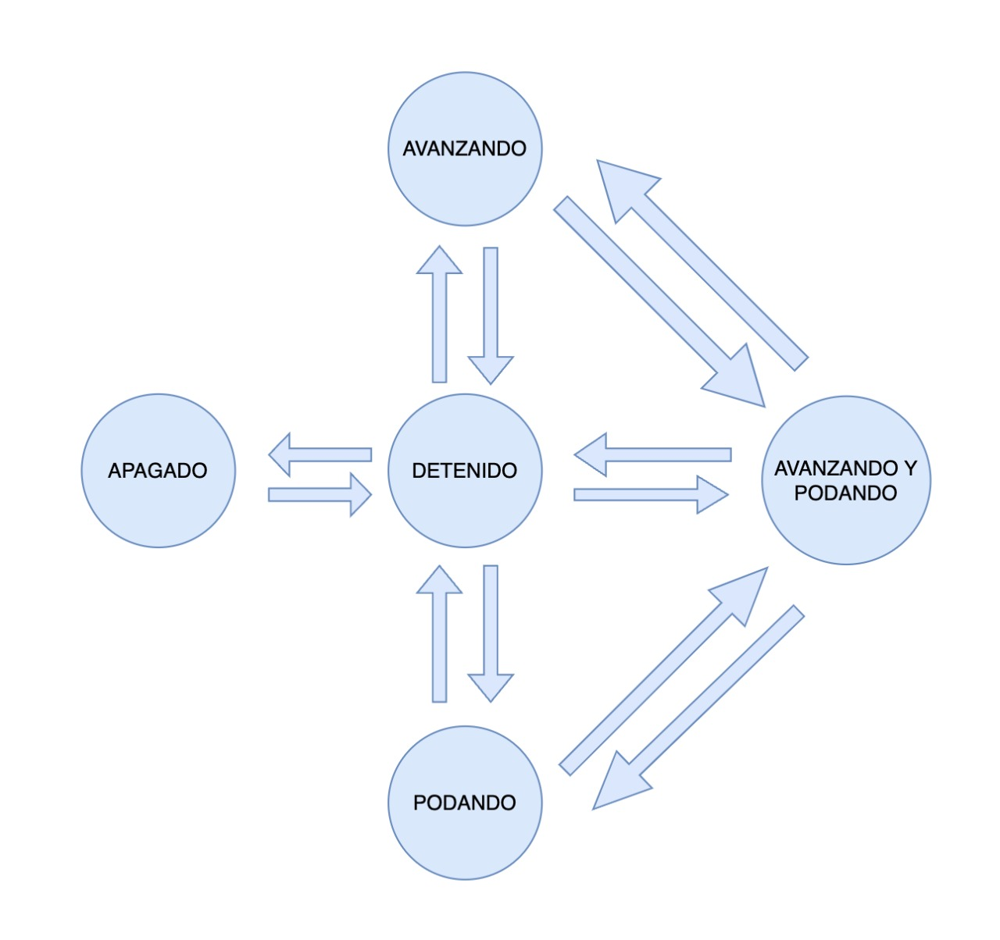

# Rover - Maquina de Estado

A continuación se muestra la definición de la maquina de estado denominada como el core de nuesto Rover.

    

Nuestra maquina de estado contempla 5 estados: 
- Apagado
- Detenido 
- Avanzado
- Podando
- Avanzando y Podando

Los inputs de cada uno son los diferentes salidas de los componentes de nuestro robot (sensores, joystick, botones de activacion), de acuerdo a estan entradas se da unos valores de salida para determianr el comportamiento de los motores y la podadora.

Nuestro estado inicial es `Apagado`, cuando se encuentra en este estado,